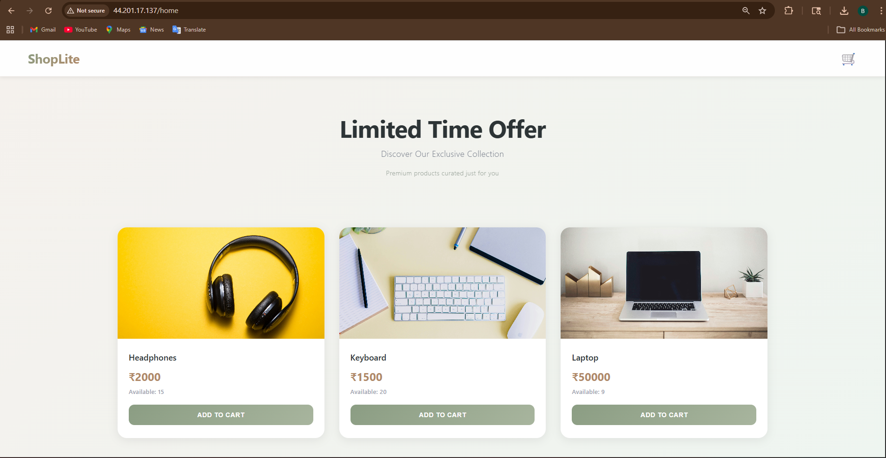
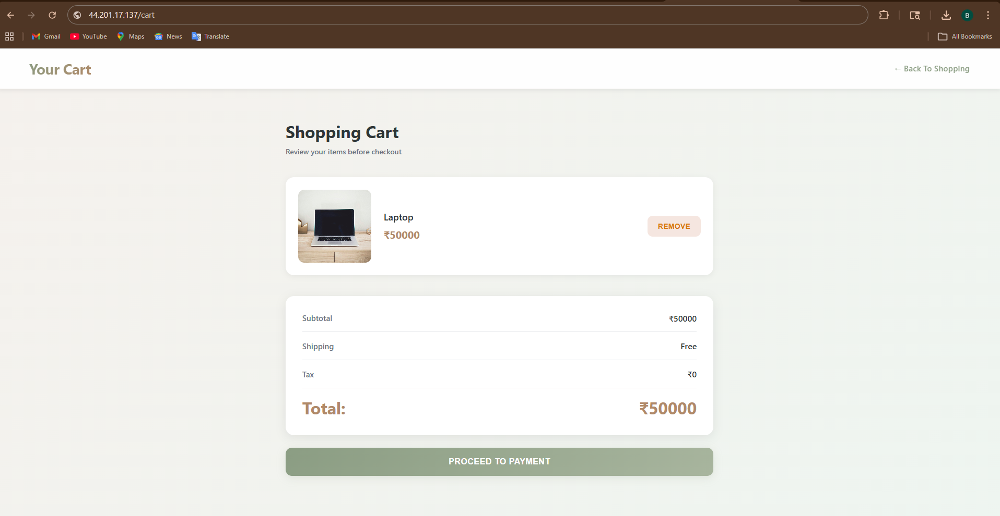
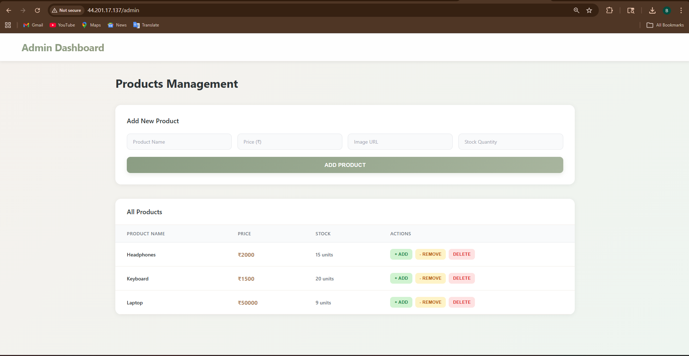

# ShopLite K8s
## Live Demo

```text
http://44.201.17.137/home
```

---

## Website Routing

The application uses NGINX Ingress and NGINX frontend routing.

Routes:

```text
/home   -> Home Page
/cart   -> Cart Page
/admin  -> Admin Dashboard
/api    -> Flask Backend API
```

## Description

ShopLite K8s is a simple 3-tier e-commerce application deployed on Kubernetes using KIND on an AWS EC2 instance.

This project demonstrates:

* Kubernetes Deployments
* ClusterIP Services
* NGINX Ingress Routing
* Persistent Volumes
* Persistent Volume Claims
* Pod-to-Pod Communication
* Docker Image Management
* 3-Tier Architecture

The application contains:

* Frontend using HTML, CSS, JavaScript, and NGINX
* Backend using Flask API
* PostgreSQL Database

The project is beginner-friendly and focuses on understanding Kubernetes networking and architecture through a practical deployment.

---

# Application Pages

## Home Page



Features:

* Product listing
* Product images
* Add to cart
* Navbar routing
* Dynamic product loading from backend API

---

## Cart Page



Features:

* View cart items
* Remove products
* Checkout simulation
* Dynamic total calculation
* Product stock updates after checkout

---

## Admin Page



Features:

* Admin authentication
* Add products
* Increase stock
* Decrease stock
* Delete products
* Real-time database updates

---

# Project Architecture

```text
                    ┌──────────────────┐
                    │     Browser      │
                    └────────┬─────────┘
                             │
                             ▼
                    ┌──────────────────┐
                    │     Ingress      │
                    │   NGINX Router   │
                    └────────┬─────────┘
                             │
          ┌──────────────────┴──────────────────┐
          │                                     │
          ▼                                     ▼
┌─────────────────────┐           ┌─────────────────────┐
│  Frontend Service   │           │  Backend Service    │
│      ClusterIP      │           │      ClusterIP      │
└──────────┬──────────┘           └──────────┬──────────┘
           │                                 │
           ▼                                 ▼
┌─────────────────────┐           ┌─────────────────────┐
│   Frontend Pod      │           │    Backend Pod      │
│      NGINX          │           │       Flask         │
└─────────────────────┘           └──────────┬──────────┘
                                              │
                                              ▼
                                   ┌─────────────────────┐
                                   │  PostgreSQL Service │
                                   │      ClusterIP      │
                                   └──────────┬──────────┘
                                              │
                                              ▼
                                   ┌─────────────────────┐
                                   │   PostgreSQL Pod    │
                                   └──────────┬──────────┘
                                              │
                                              ▼
                                   ┌─────────────────────┐
                                   │ Persistent Volume   │
                                   └─────────────────────┘
```

---

# Clone Repository

```bash
git clone https://github.com/Zaid2044/shoplite-k8s.git
```

This command downloads the complete project from GitHub to your local machine or EC2 instance.

---

# Enter Project Directory

```bash
cd shoplite-k8s
```

This command moves into the project directory.

---

# Create KIND Cluster

```bash
kind create cluster --name shoplite-cluster --config kind-config.yaml
```

This command creates a Kubernetes cluster using KIND with custom port mappings defined in `kind-config.yaml`.

The configuration exposes:

* Port 80 for HTTP traffic
* Port 443 for HTTPS traffic

---

# Build Frontend Docker Image

```bash
docker build -t shoplite-frontend ./frontend
```

This command builds the frontend Docker image using the frontend Dockerfile.

---

# Build Backend Docker Image

```bash
docker build -t shoplite-backend ./backend
```

This command builds the Flask backend Docker image.

---

# Load Docker Images Into KIND

```bash
kind load docker-image shoplite-frontend --name shoplite-cluster
```

This command loads the frontend Docker image directly into the KIND cluster.

```bash
kind load docker-image shoplite-backend --name shoplite-cluster
```

This command loads the backend Docker image into the KIND cluster.

---

# Check Kubernetes Cluster

```bash
kubectl get nodes
```

This command checks whether the Kubernetes cluster is running successfully.

---

# Kubernetes Concepts Used

## Deployment

Deployments manage application pods inside Kubernetes.

This project uses deployments for:

* Frontend
* Backend
* PostgreSQL

Responsibilities of Deployments:

* Create pods
* Maintain desired replicas
* Restart failed pods
* Handle rolling updates

---

## ClusterIP Service

ClusterIP services enable communication between pods inside the Kubernetes cluster.

This project uses:

* frontend-service
* backend-service
* postgres-service

Flow:

```text
Frontend Pod
      │
      ▼
backend-service
      │
      ▼
Backend Pod
      │
      ▼
postgres-service
      │
      ▼
PostgreSQL Pod
```

---

## Ingress

Ingress acts as a reverse proxy and routes external traffic to internal Kubernetes services.

Routes used in this project:

```text
/home   -> frontend-service
/cart   -> frontend-service
/admin  -> frontend-service
/api    -> backend-service
```

Ingress Flow:

```text
Browser Request
       │
       ▼
Ingress Controller
       │
 ┌─────┴─────┐
 ▼           ▼
Frontend   Backend
Service    Service
```

---

# Apply Kubernetes Manifests

```bash
kubectl apply -f k8s/
```

This command applies all Kubernetes YAML manifests inside the `k8s` directory.

It creates:

* Persistent Volume
* Persistent Volume Claim
* PostgreSQL Deployment
* PostgreSQL Service
* Backend Deployment
* Backend Service
* Frontend Deployment
* Frontend Service
* Ingress

---

# Allow HTTP Traffic In AWS Security Group

Allow inbound traffic on:

* Port 80
* Port 443

AWS EC2 Security Group:

```text
Inbound Rules

Type        Port
HTTP        80
HTTPS       443
```

---

# Check Running Resources

```bash
kubectl get pods
```

```bash
kubectl get svc
```

```bash
kubectl get ingress
```

These commands verify that Kubernetes resources are running successfully.

---

# Access Application

```text
http://YOUR_EC2_PUBLIC_IP/home
```

```text
http://YOUR_EC2_PUBLIC_IP/cart
```

```text
http://YOUR_EC2_PUBLIC_IP/admin
```

---

# Tech Stack

* Kubernetes
* KIND
* Docker
* NGINX
* Flask
* PostgreSQL
* HTML
* CSS
* JavaScript
* AWS EC2

---

# Learning Outcomes

This project helps understand:

* Kubernetes architecture
* Kubernetes networking
* Pod communication
* Service discovery
* Ingress routing
* Persistent storage
* Docker containerization
* 3-tier appli
